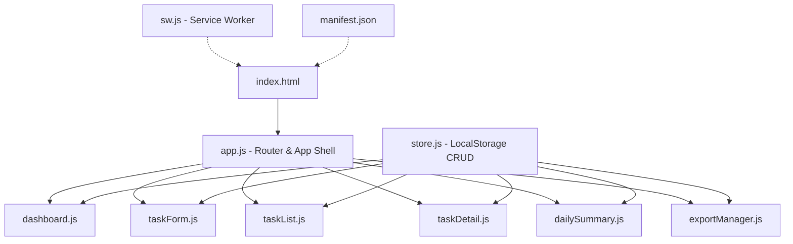

# Daily Work Log & Task Tracker PWA — Implementation Plan

A professional PWA for logging daily work activities, tracking tasks, and generating reports. Built with vanilla HTML5, CSS3, and JavaScript with LocalStorage persistence.

---

## Proposed Changes

### Architecture Overview

```
Single-page application (SPA) architecture with hash-based routing.
All data persisted in LocalStorage.
Service Worker for offline support and caching.
Modular JS with ES6 modules (no bundler needed).
```



---

### File Structure

```
DailyLogger/
├── index.html                  # App shell, navigation, all views
├── manifest.json               # PWA manifest
├── sw.js                       # Service worker
├── css/
│   ├── index.css               # Design system tokens & base styles
│   ├── components.css           # Reusable component styles
│   ├── dashboard.css            # Dashboard-specific styles
│   ├── forms.css                # Form styles
│   ├── task-list.css            # Task list/card styles
│   └── responsive.css           # Media queries & responsive overrides
├── js/
│   ├── app.js                  # App initialization, router, navigation
│   ├── store.js                # LocalStorage data layer (CRUD)
│   ├── dashboard.js            # Dashboard metrics & charts
│   ├── taskForm.js             # Add/Edit task form logic
│   ├── taskList.js             # Task list, search, filter, sort
│   ├── taskDetail.js           # Task detail view
│   ├── dailySummary.js         # Daily summary generation
│   ├── exportManager.js        # PDF & CSV export
│   └── utils.js                # Helpers (UUID, date formatting, etc.)
├── icons/
│   ├── icon-192.png
│   ├── icon-512.png
│   └── favicon.ico
└── README.md
```

---

### Design System

#### Color Palette (Dark Mode Primary)

| Token | Value | Usage |
|-------|-------|-------|
| `--bg-primary` | `hsl(225, 25%, 8%)` | Main background |
| `--bg-secondary` | `hsl(225, 20%, 12%)` | Cards, panels |
| `--bg-tertiary` | `hsl(225, 18%, 16%)` | Elevated surfaces |
| `--bg-glass` | `hsla(225, 20%, 15%, 0.6)` | Glassmorphism panels |
| `--accent-primary` | `hsl(250, 85%, 65%)` | Primary actions, links |
| `--accent-secondary` | `hsl(170, 70%, 50%)` | Success, completed |
| `--accent-warning` | `hsl(40, 90%, 60%)` | Pending, on hold |
| `--accent-danger` | `hsl(0, 75%, 60%)` | Delete, errors |
| `--text-primary` | `hsl(0, 0%, 95%)` | Main text |
| `--text-secondary` | `hsl(225, 15%, 60%)` | Secondary text |
| `--border` | `hsla(225, 20%, 30%, 0.5)` | Borders |

#### Typography

- **Font**: Inter (Google Fonts) with system fallback
- **Headings**: 600-700 weight, letter-spacing -0.02em
- **Body**: 400 weight, 1.6 line-height

#### Effects

- Glassmorphism: `backdrop-filter: blur(20px)` with semi-transparent backgrounds
- Smooth gradients on cards and status badges
- Micro-animations: 200-300ms transitions on hover/focus
- Floating action button with pulse animation
- Card entrance animations (fade-in + slide-up)

---

### Component Breakdown

#### [NEW] [index.html](file:///Users/rituraj/Downloads/Projects/DailyLogger/index.html)
- HTML5 shell with all 4 views (Dashboard, Add Task, Task List, Task Detail)
- Navigation bar (bottom on mobile, side on desktop)
- View containers toggled via JS router
- Meta tags for PWA, SEO, and viewport
- Google Fonts (Inter) import

---

#### [NEW] [css/index.css](file:///Users/rituraj/Downloads/Projects/DailyLogger/css/index.css)
- CSS custom properties (design tokens)
- CSS reset / normalize
- Base typography
- Utility classes
- Animation keyframes (fadeIn, slideUp, pulse)

#### [NEW] [css/components.css](file:///Users/rituraj/Downloads/Projects/DailyLogger/css/components.css)
- Status badges (color-coded by status)
- Buttons (primary, secondary, danger, ghost)
- Modal / dialog styles
- Toast notifications
- Search bar
- Filter chips
- FAB (Floating Action Button)

#### [NEW] [css/dashboard.css](file:///Users/rituraj/Downloads/Projects/DailyLogger/css/dashboard.css)
- Metric cards (glassmorphism, gradient accents)
- Today's tasks section
- Summary section

#### [NEW] [css/forms.css](file:///Users/rituraj/Downloads/Projects/DailyLogger/css/forms.css)
- Input fields (text, textarea, select, date)
- Form layout and spacing
- Validation states

#### [NEW] [css/task-list.css](file:///Users/rituraj/Downloads/Projects/DailyLogger/css/task-list.css)
- Task card layout
- Grid/list view toggle
- Empty state illustration

#### [NEW] [css/responsive.css](file:///Users/rituraj/Downloads/Projects/DailyLogger/css/responsive.css)
- Mobile-first breakpoints (480px, 768px, 1024px, 1280px)
- Bottom nav on mobile, sidebar on desktop
- Card layout adjustments

---

#### [NEW] [js/store.js](file:///Users/rituraj/Downloads/Projects/DailyLogger/js/store.js)
- `getAllTasks()` — retrieve all tasks from LocalStorage
- `getTaskById(id)` — get single task
- `createTask(taskData)` — create with UUID and timestamp
- `updateTask(id, taskData)` — update existing
- `deleteTask(id)` — remove task
- `searchTasks(query)` — search by title, collaborator, project
- `filterTasks({ status, dateRange })` — filter by status & date
- `getTaskStats()` — compute dashboard metrics
- `getDailySummary(date)` — generate daily summary data
- Event system for data change notifications

#### [NEW] [js/app.js](file:///Users/rituraj/Downloads/Projects/DailyLogger/js/app.js)
- Hash-based router (`#/`, `#/add`, `#/tasks`, `#/task/:id`, `#/edit/:id`, `#/summary`)
- Navigation state management
- View switching with transitions
- PWA install prompt handling
- Service worker registration

#### [NEW] [js/dashboard.js](file:///Users/rituraj/Downloads/Projects/DailyLogger/js/dashboard.js)
- Render metric cards (Total, Pending, In Progress, Completed, On Hold)
- Render today's tasks list
- Quick-add button handler
- Animated counter for metrics

#### [NEW] [js/taskForm.js](file:///Users/rituraj/Downloads/Projects/DailyLogger/js/taskForm.js)
- Render add/edit form
- Form validation
- Department dropdown (predefined list)
- Status dropdown
- Date picker (defaults to today)
- Save handler (create or update based on context)

#### [NEW] [js/taskList.js](file:///Users/rituraj/Downloads/Projects/DailyLogger/js/taskList.js)
- Render task cards in responsive grid
- Real-time search with debounce
- Status filter chips
- Date filter (Today, This Week, This Month)
- Sort by date (newest first default)
- Empty state handling

#### [NEW] [js/taskDetail.js](file:///Users/rituraj/Downloads/Projects/DailyLogger/js/taskDetail.js)
- Full task detail view
- Edit button → navigate to edit form
- Delete button with confirmation modal
- Status badge with color coding

#### [NEW] [js/dailySummary.js](file:///Users/rituraj/Downloads/Projects/DailyLogger/js/dailySummary.js)
- Date picker for summary date
- Auto-generate summary:
  - Tasks completed count
  - Tasks in progress count
  - Unique collaborators list
  - Projects worked on

#### [NEW] [js/exportManager.js](file:///Users/rituraj/Downloads/Projects/DailyLogger/js/exportManager.js)
- CSV export (date range selection, generates downloadable file)
- PDF export using browser print API with styled print layout
- Report includes: date range, task list, status summary, collaborators

#### [NEW] [js/utils.js](file:///Users/rituraj/Downloads/Projects/DailyLogger/js/utils.js)
- `generateUUID()` — crypto.randomUUID() with fallback
- `formatDate(date)` — locale-aware date formatting
- `debounce(fn, delay)` — for search input
- `getWeekRange(date)` — start/end of week
- `getMonthRange(date)` — start/end of month
- `escapeHtml(str)` — XSS prevention

---

#### [NEW] [manifest.json](file:///Users/rituraj/Downloads/Projects/DailyLogger/manifest.json)
- App name: "Daily Work Log"
- Short name: "WorkLog"
- Theme color matching design system
- Icons (192x192, 512x512)
- Display: standalone
- Start URL: `/`
- Background color

#### [NEW] [sw.js](file:///Users/rituraj/Downloads/Projects/DailyLogger/sw.js)
- Cache-first strategy for static assets
- Network-first for dynamic content
- Offline fallback
- Cache versioning for updates

#### [NEW] Icons
- Generate app icons using the image generation tool
- 192x192 and 512x512 PNG icons
- Favicon

---

## Verification Plan

### Manual Verification
1. **Dashboard**: Verify metric cards update correctly when tasks are added/modified
2. **CRUD**: Create, read, update, delete tasks and verify LocalStorage persistence
3. **Search/Filter**: Test instant search and all filter combinations
4. **Daily Summary**: Verify auto-generated summary accuracy
5. **Export**: Test CSV download and PDF print layout
6. **PWA**: Test install prompt, offline mode, and service worker caching
7. **Responsive**: Test on mobile (375px), tablet (768px), and desktop (1280px) viewports
8. **Offline**: Disable network and verify all CRUD operations work

### Browser Testing
- Serve locally with `npx serve .` or Python's `http.server`
- Test in Chrome DevTools (mobile simulation, offline mode, Lighthouse PWA audit)
